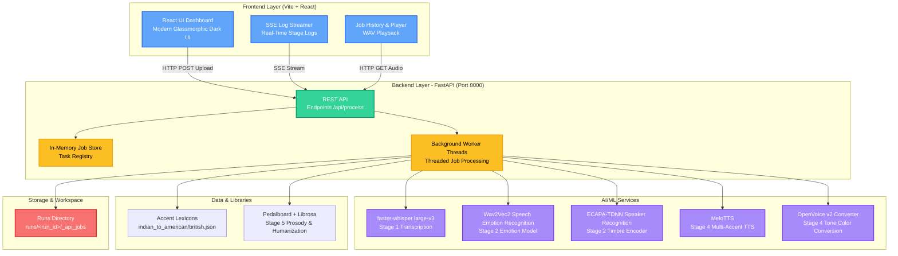
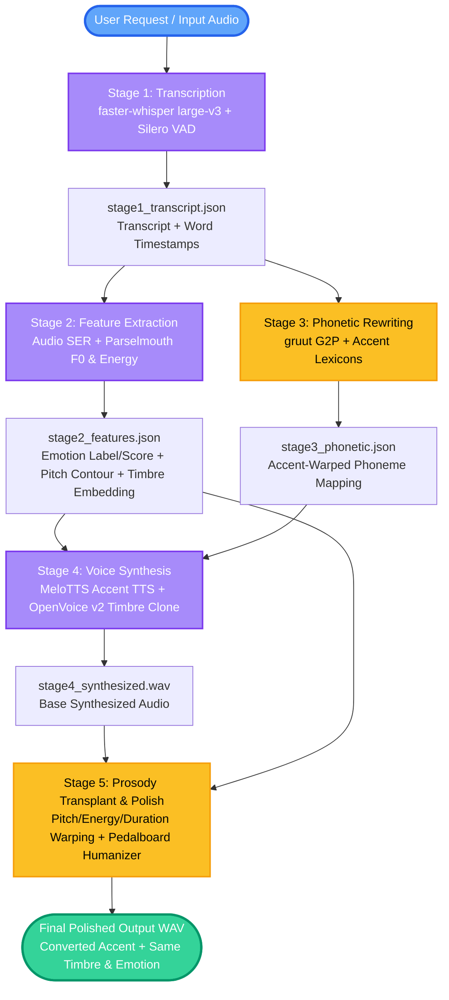
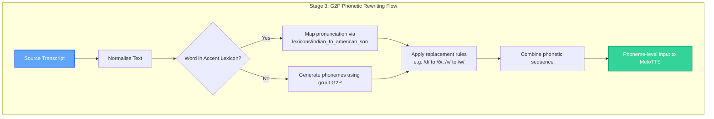

# VoiceBridge - Emotion-Preserving Accent Conversion

A modern voice translation pipeline that converts speech in one accent (e.g. Indian English) to a target accent (e.g. American or British English) while preserving the speaker's vocal identity (timbre) and emotional tone using advanced ML models.

## Features

- **Audio-Based Emotion Modeling**: Preserves emotional tone by extracting F0 (pitch) contours and energy envelopes from the source audio using an audio-based Speech Emotion Recognition (SER) model (`wav2vec2-lg-xlsr-en-speech-emotion-recognition`).
- **Timbre & Vocal Identity Cloning**: Employs OpenVoice v2's ToneColorConverter to extract the speaker's vocal timbre and apply it back onto synthesized accent audio, maintaining voice identity.
- **Accent Phonetics Rewriting**: Rewrites Indian English phonetics to target American or British English pronunciation using a structured G2P system (`gruut`) and accent-mapping lexicons.
- **Advanced Prosody Transplant**: Fuses synthesized voice with the original's natural flow by transplanting the pitch contour (via high-resolution `librosa` pitch shift with a pitch bias) and energy dynamics.
- **Dynamic Emotion Amplifier**: Restores and boosts suppressed emotional dynamics from synthesized audio with a soft-knee compressor/expander.
- **Pedalboard Audio Humanizer**: Polishes the final speech with professional-grade EQ, compression, and reverb filters to eliminate robotic digital artifacts and deliver a clean, human feel.
- **Streaming Stage Diagnostics**: Features a responsive React dashboard streaming pipeline execution logs in real-time via Server-Sent Events (SSE).

## System Architecture

High-level overview of the VoiceBridge ecosystem:



---

### 1. Accent & Emotion Conversion Pipeline
The core logic for processing and translating audio:



### 2. Stage 3: G2P Phonetic Rewriting
How phoneme structures are mapping between accents:



### 3. Stage 5: Prosody Transplant & Polish
Details of the final audio warping and humanization:

```mermaid
graph TB
    subgraph "Stage 5: Prosody Transplant & Polish Pipeline"
        S4_Wav[stage4_synthesized.wav<br/>Raw Synthesized Audio] --> Pitch[5a. F0 Pitch Alignment<br/>librosa.effects.pitch_shift + -1.5st Bias]
        
        Pitch --> Expand[5b. Dynamic Emotion Amplifier<br/>Soft-knee Expander ratio=2.2 / knee=-8dB]
        
        Expand --> Energy[5c. Energy Envelope Transplant<br/>Gaussian-smoothed RMS Energy mapping]
        
        Energy --> Stretch[5d. Duration Matching<br/>librosa.effects.time_stretch to source rate]
        
        Stretch --> Human[5e. Audio Humanizer<br/>Pedalboard EQ + Compressor + Reverb]
        
        Human --> Out[output.wav<br/>Final Polished Speech]
    end
    
    style S4_Wav fill:#60a5fa,stroke:#2563eb,stroke-width:2px,color:#fff
    style Out fill:#34d399,stroke:#059669,stroke-width:2px,color:#fff
    style Human fill:#fbbf24,stroke:#f59e0b,stroke-width:2px,color:#000
```



---

## Tech Stack

### Frontend
- **Framework**: React 19 + Vite
- **Styling**: Vanilla CSS (Fluid Glassmorphic UI with animated gradients & background orbs)
- **Icons**: Custom SVG icons / Badges

### Backend
- **Framework**: FastAPI (Python 3.10+)
- **Concurrency**: Background thread worker pool to queue and process CPU-bound audio pipelines
- **APIs & Protocols**: REST endpoints, SSE (Server-Sent Events) for real-time log streaming

### AI/ML Pipeline Models
- **Transcription**: `faster-whisper` large-v3 + Silero VAD (Voice Activity Detection)
- **Speech Emotion Recognition (SER)**: Wav2Vec2 (`ehcalabres/wav2vec2-lg-xlsr-en-speech-emotion-recognition`)
- **Speaker Recognition/Timbre**: ECAPA-TDNN (`speechbrain/spkrec-ecapa-voxceleb`)
- **Speech Synthesis**: MeloTTS (accent-specific VITS engine)
- **Voice Cloning**: OpenVoice v2 ToneColorConverter

### Audio DSP & Post-Processing
- **Features / Analysis**: `praat-parselmouth` (F0/pitch & intensity analysis)
- **DSP Operations**: `librosa` (pitch shifting, time-stretching, resampling)
- **Audio Effects / Humanizer**: `pedalboard` (Parametric EQ, Peak Compressor, and Reverb)

---

## Project Setup & Run Guide

Follow these steps to set up and run the VoiceBridge project locally.

### Prerequisites

Ensure you have:
1. **Python 3.10.11** installed.
2. **Node.js (v18+)** installed.
3. **FFmpeg** installed and added to your system `PATH` (critical for loading/processing audio).

---

### Step 1: Install Python Dependencies

1. Open a terminal in the project root directory.
2. Create and activate a virtual environment:
   ```powershell
   python -m venv venv
   .\venv\Scripts\activate
   ```
3. Install the packages from `requirements.txt`:
   ```bash
   pip install -r requirements.txt
   ```
4. Install MeloTTS (direct from the source without dependencies):
   ```bash
   pip install git+https://github.com/myshell-ai/MeloTTS.git --no-deps
   ```

---

### Step 2: Download Model Checkpoints & Resources

Run the following setup commands to download OpenVoice v2 checkpoints and linguistic models:

1. **OpenVoice v2 Checkpoints** (saves to `checkpoints_v2/`):
   ```bash
   pip install huggingface_hub
   python -c "from huggingface_hub import snapshot_download; snapshot_download(repo_id='myshell-ai/OpenVoiceV2', local_dir='checkpoints_v2')"
   ```
2. **Linguistic Assets** (NLTK dictionaries and unidic phonemes):
   ```bash
   python -c "import nltk; nltk.download('averaged_perceptron_tagger_eng'); nltk.download('cmudict')"
   python -m unidic download
   ```

---

### Step 3: Run the Application

#### 1. Start the FastAPI Backend
```bash
python server.py
```
- **API Documentation**: [http://localhost:8000/docs](http://localhost:8000/docs)
- **Backend URL**: [http://localhost:8000](http://localhost:8000)

#### 2. Start the React Frontend
Open a new terminal window, then:
```bash
cd frontend
npm install
npm run dev
```
- **Frontend URL**: [http://localhost:5173](http://localhost:5173)

---

### Troubleshooting

- **TypeError `run_pipeline() got an unexpected keyword argument 'audio_path'`**:
  If the backend throws this error during job processing, it means an older version of the server code is cached in memory. Close the backend server (`Ctrl + C`) and run `python server.py` again.
- **Port 8000 or 5173 is already in use**:
  Ensure you do not have other instances of FastAPI or Vite running. You can check task manager or kill processes occupying these ports.
- **HuggingFace / PyTorch Download Errors**:
  Ensure you have a stable internet connection on the first run, as the pipeline will download `faster-whisper`, `wav2vec2`, and `ECAPA-TDNN` models on demand.
